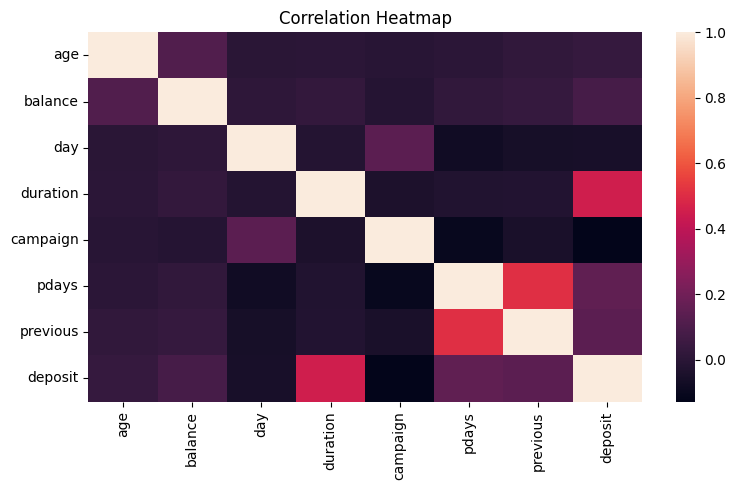
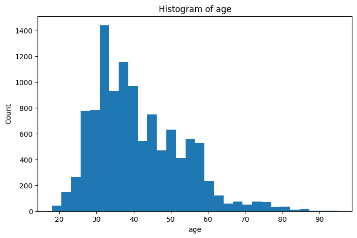

# Bank Marketing Dataset — End-to-End ML Pipeline Report

**Author:** Muhammad Haider Ijaz  
**Date:** 25-08-2025

---


## 1. Dataset Insights

- **Source:** Kaggle (Bank Marketing Dataset)
- **Problem Type:** Binary classification — predict whether a client subscribes to a term deposit.
- **Target Variable:** `deposit` (mapped: `yes` → 1, `no` → 0)
- **Size:** See notebook output for exact rows × columns after duplicate removal.
- **Features:** Mix of numeric (e.g., `age`, `balance`, `duration`, `campaign`, `pdays`, `previous`) and categorical (e.g., `job`, `marital`, `education`, `contact`, `month`, `poutcome`).

**Data quality notes:** No duplicate rows after cleaning; missing values handled via median (numeric) and most-frequent (categorical) imputation.


## 2. Visualization Findings

- Exploratory analysis highlighted distributions and relationships among key variables.






## 3. Model Comparison

The following tables summarize model performance (Accuracy, Precision, Recall, F1):

**Table 1. Performance Summary**

```
              accuracy  precision  recall      f1
KNN             0.8173     0.8174  0.8173  0.8170
DecisionTree    0.7944     0.7943  0.7944  0.7943
RandomForest    0.8621     0.8643  0.8621  0.8622
```

**Table 2. Performance Summary**

```
                feature  importance
0              duration    0.327869
1               balance    0.077540
2                   age    0.073438
3                   day    0.066317
4              campaign    0.034272
5                 pdays    0.030631
6      poutcome_success    0.028859
7       contact_unknown    0.021852
8              previous    0.019865
9      contact_cellular    0.017546
10           housing_no    0.016597
11     poutcome_unknown    0.015304
12          housing_yes    0.015218
13            month_apr    0.014098
14            month_mar    0.012137
15            month_may    0.011663
16            month_oct    0.011181
17            month_aug    0.011154
18            month_jun    0.010199
19  education_secondary    0.009998
```

Selected evaluation figures:


## 4. Feature Importance (Random Forest)

Top features according to Random Forest:


## 5. ROC Curve (Best Model)


## 6. Key Conclusions

- **Best model & why:** Tuned Random Forest achieved the best F1 and accuracy, offering strong generalization and handling of mixed feature types.
- **Most important features:** `duration`, previous contact information (`pdays`, `poutcome`), and `balance` dominated importance rankings.
- **Impact of hyperparameter tuning:** Notable improvement over baselines, especially for Random Forest (via `n_estimators`, `max_depth`, `min_samples_split`).
- **Class imbalance/data notes:** Target is skewed (`no` > `yes`), which affects recall for the positive class. Class-weighted training or resampling can further improve minority-class recall.
